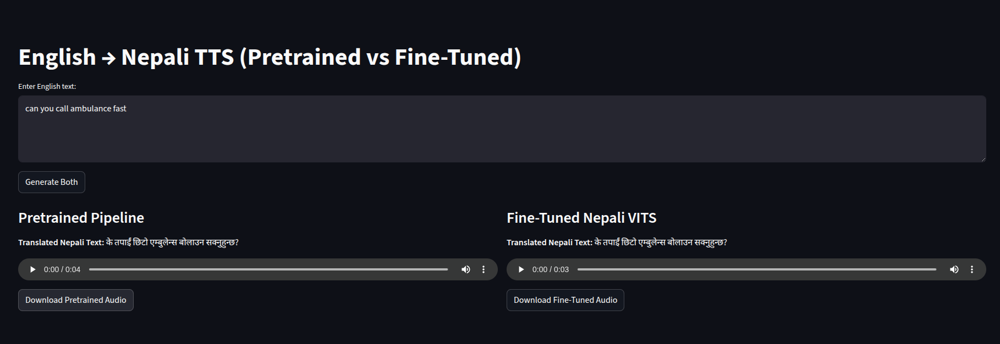

# ENGLISH TEXT TO NEPALI SPEECH CONVERTER

A research-oriented, end-to-end Nepali text-to-speech (TTS) system built on Hugging Face Transformers + VITS-style models with a Streamlit UI and training utilities. Designed for experiments, fine-tuning on Nepali datasets, and simple integration into web apps.

---

## Motivation / Reason for the project

Nepali is an under-resourced language in the open-source TTS space. This project exists to:

- Provide a reproducible pipeline for training and fine-tuning neural TTS models on Nepali data.
- Enable quick experimentation (voices, prosody, dataset cleanup).
- Supply a lightweight Streamlit UI for demoing and embedding TTS functionality.
- Serve as a research playground for comparing **pre-trained vs fine-tuned models**.

---

## Code Style

- **Python:** PEP8 for formatting

---

## Screenshots

1. **Homepage**  
   

2. **After entering text**  
   

---

## Framework & Technologies Used

- **Deep Learning Framework:** PyTorch
- **Model Hub:** Hugging Face Transformers (VITS, AutoProcessor)
- **Dataset Management:** Hugging Face Datasets
- **Frontend Demo:** Streamlit
- **Audio Processing:** Librosa, SoundFile, SciPy
- **Utilities:** NumPy, Pandas, tqdm

---

## Features

- Convert **English text → Nepali speech** in real-time.
- Fine-tune VITS-based models on Nepali datasets.
- Simple **Streamlit UI** for entering text and playing generated audio.
- Modular design: Translator → TTS Model → Output.
- Extendable for multiple voices and datasets.

---

## Installation Guidelines

1. Clone the repository:

   ```bash
   git clone https://git.bajratechnologies.com/j-25-06/j-25-06-ai/saurav-karki/text-to-speech.git
   cd text-to-speech
   ```

2. Create environment

   ```bash
   python -m venv venv

   source venv/bin/activate   # macOS/Linux
   venv\Scripts\activate      # Windows
   ```

3. Install dependencies

   ```bash
   pip install -r requirements.txt
   ```

4. Run the Server
   ```bash
   streamlit run main.py
   ```

## Quick Example (Text to Speech)

```python
from transformers import VitsModel, AutoProcessor
from IPython.display import Audio, display


model = VitsModel.from_pretrained("./fine_tuned_nepali_vits_v5.2")
processor = AutoProcessor.from_pretrained("./fine_tuned_nepali_vits_v5.2")

# Your input text
text = "म छु, तिमी छौ"
inputs = processor(text, return_tensors="pt")  # Move inputs to same device as model

# Inference
with torch.no_grad():
    output = ft_model(**inputs).waveform  # waveform will be on the same device

# Move waveform to CPU for playback
output = output.cpu()

# Play audio
Audio(output.numpy(), rate=ft_model.config.sampling_rate)

```
# English-Text-to-Nepali-Speech-Converter-Fine-tuned-
# English-Text-to-Nepali-Speech-Modee-FT
